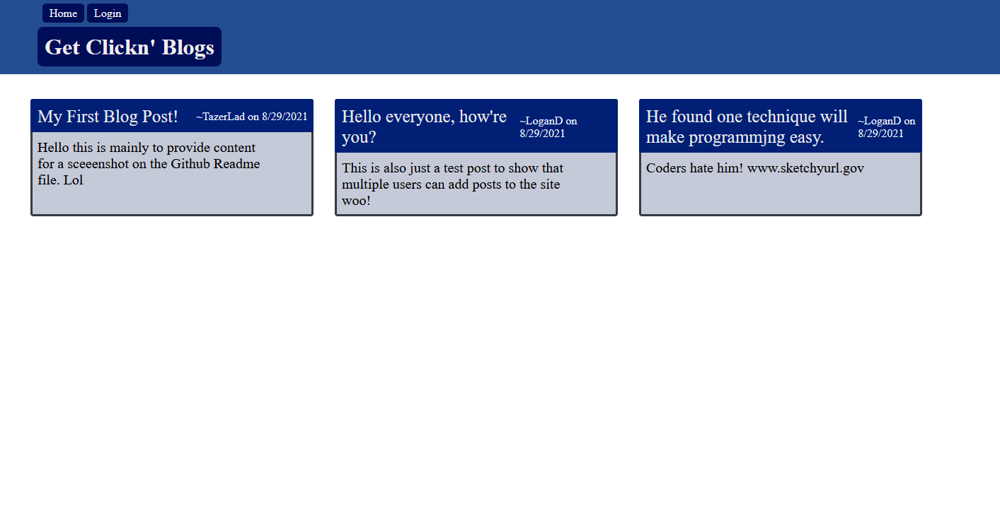
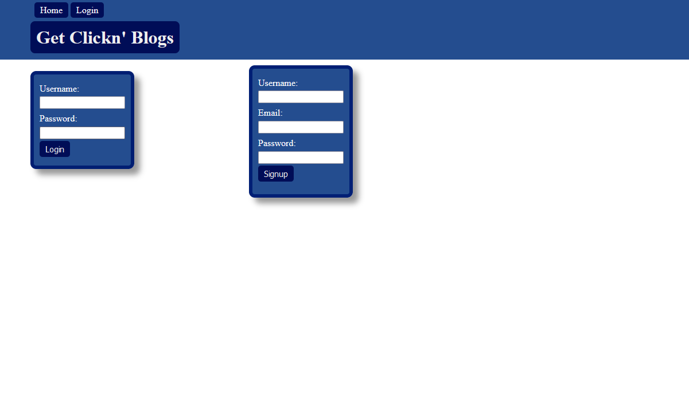
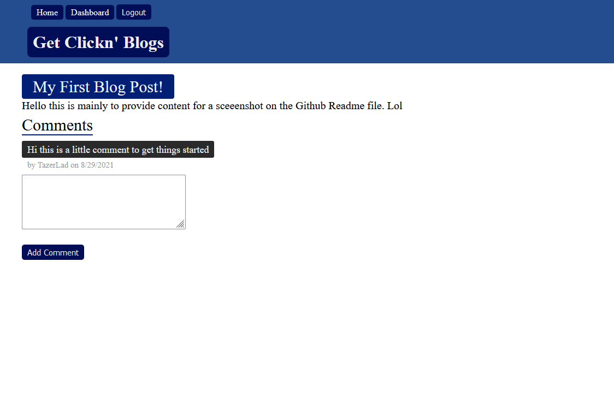

## Challenge Fourteen MVC_Structure_Tech_Blog

### Description
For this week's challenge, we were tasked with essentially compiling everything we have learned throughout this bootcamp to create a functioning Tech Blog hosted on Heroku. This was a fun challenge to go along with our firt project since we are doing simmilar things. It was interesting to get back to flexing CSS muscles that I hadn't used in a while, since we have been largely focusing on the back end of applications. 

As for the MVC structure, it was I think effective for keeping everthing neat and in order. It also made dissecting a particular problem easier since the functionaliy, or in an error's case lackthereof, could be traced to one of a couple files. There defenitely a bit of a learning curve, but after that things felt more natural.

### Screenshots
This is the home page, complete with a few test posts to showcase how those look

This is the login/register page

Logging in or Registering lets you access your dashboard where you can view/edit/delete your posts or create a new one

Clicking on a post will let you view the comments on it and leave one yourself if you are logged in.

### Links
Github: [Link](https://github.com/LoganDufek/MVC_Structure_Tech_Blog)
Live Site: [Link](https://young-retreat-87062.herokuapp.com/)